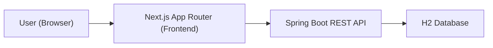

# TeamFlow MVP Spec

## 1) 서비스 개요
- 목표: 개인 메모 수준의 빠른 할 일 입력 + 팀 공유 기능을 제공하는 경량 웹앱
- 제품 방향: Jira/Notion 같은 복잡한 협업툴이 아니라 Apple Reminder / Microsoft To Do 스타일의 단순성
- 핵심 가치:
  1. 몇 초 내 할 일 입력
  2. 오늘 기준 빠른 조회
  3. 자연스러운 공유

## 2) MVP 범위
### 포함
- 내부 사용자 로그인 (단순 로그인)
- 빠른 할 일 등록 (제목 필수, 설명/마감일/담당자/공유대상 선택)
- 내 할 일 조회 필터: 오늘 / 예정됨 / 전체 / 완료됨
- 공유된 할 일 조회: 나에게 할당됨 / 나에게 공유됨
- 상태: TODO / IN_PROGRESS / DONE
- 댓글: 단순 텍스트, 스레드 없음
- 기본 알림: 담당자 지정 / 공유 / 댓글

### 제외 (명시적 비범위)
- OAuth/SSO
- WebSocket/실시간 푸시
- 간트차트, 칸반 보드, 프로젝트/에픽 구조
- 다단계 태스크(서브태스크 트리)
- 복잡한 권한 정책 엔진

## 3) 기술 스택
- Backend: Spring Boot `4.0.4`(최신 안정), Spring Data JPA, H2, Validation
- API 스타일: REST
- Frontend: Next.js `16`(최신 안정), TypeScript, App Router
- UI: React + Tailwind CSS
- 공통 원칙: 가독성/유지보수 우선, 과도한 추상화 지양

## 4) 도메인 모델

### User
- id (Long)
- name (String)
- email (String, unique)
- password (String)
- createdAt (LocalDateTime)

### Task
- id (Long)
- title (String, required)
- description (String, optional)
- status (Enum: TODO, IN_PROGRESS, DONE)
- dueAt (LocalDateTime, optional)
- creator (User, required)
- assignee (User, optional, 1명)
- createdAt / updatedAt / completedAt (LocalDateTime)

### TaskShare
- id (Long)
- task (Task)
- user (User)
- unique(task, user)

### TaskComment
- id (Long)
- task (Task)
- writer (User)
- content (String, required)
- createdAt (LocalDateTime)

### Notification
- id (Long)
- user (User)
- task (Task)
- type (Enum: ASSIGNED, SHARED, COMMENTED)
- message (String)
- read (boolean)
- createdAt (LocalDateTime)

## 5) 권한 정책 (단순)
- 작성자(creator): 수정/삭제/공유 가능
- 담당자(assignee): 상태 변경, 댓글 가능
- 공유대상(shared user): 조회, 댓글 가능
- 공통: 접근권한 없는 사용자는 태스크 상세 조회 불가 (403)

## 6) 백엔드 설계

### 패키지 구조
```text
backend/
  src/main/java/com/example/teamflow/
    common/
      exception/
      response/
      config/
    auth/
      controller/
      service/
      dto/
    user/
      entity/
      repository/
      service/
    task/
      entity/
      repository/
      service/
      controller/
      dto/request/
      dto/response/
    share/
      entity/
      repository/
      service/
      controller/
    comment/
      entity/
      repository/
      service/
      controller/
    notification/
      entity/
      repository/
      service/
      controller/
```

### 구현 기준
- 레이어: Controller / Service / Repository / DTO
- Request/Response DTO 분리
- `jakarta.validation` 적용 (`@NotBlank`, `@Size`, `@Email` 등)
- Global Exception Handler (`@RestControllerAdvice`)
- JPA 무한참조 방지:
  - 엔티티 직접 반환 금지
  - 응답은 Response DTO로만 직렬화
- Auditing 또는 BaseTimeEntity로 생성/수정시간 관리
- H2 사용 (개발/데모용)

### API 명세 (MVP)
#### Auth
- `POST /api/auth/login`

#### Task
- `POST /api/tasks`
- `GET /api/tasks/my?filter=today|upcoming|all|done`
- `GET /api/tasks/shared`
- `GET /api/tasks/{id}`
- `PUT /api/tasks/{id}`
- `PATCH /api/tasks/{id}/status`
- `DELETE /api/tasks/{id}`

#### Share
- `POST /api/tasks/{id}/shares`
- `DELETE /api/tasks/{id}/shares/{userId}`

#### Comment
- `POST /api/tasks/{id}/comments`
- `GET /api/tasks/{id}/comments`

#### Notification
- `GET /api/notifications`
- `PATCH /api/notifications/{id}/read`

## 7) 프론트엔드 설계

### 라우트(App Router)
- `/login` 로그인
- `/` 홈(오늘 중심 대시보드)
- `/my-tasks` 내 할 일
- `/shared` 공유됨
- 태스크 상세: 별도 풀페이지 대신 우측 사이드 패널(드로어)

### 폴더 구조
```text
frontend/
  app/
    login/page.tsx
    page.tsx
    my-tasks/page.tsx
    shared/page.tsx
    layout.tsx
  components/
    task/QuickAddBar.tsx
    task/TaskList.tsx
    task/TaskItem.tsx
    task/TaskDetailDrawer.tsx
    comment/CommentList.tsx
    comment/CommentInput.tsx
    notification/NotificationPanel.tsx
    common/TopNav.tsx
    common/FilterTabs.tsx
  lib/
    api/client.ts
    api/auth.ts
    api/tasks.ts
    api/comments.ts
    api/notifications.ts
  types/
    task.ts
    user.ts
    notification.ts
```

### UX 원칙 반영
- 상단 고정 빠른 입력창: 제목 엔터 즉시 등록
- 리스트 중심 UI: 체크박스/제목/마감일/담당자/공유/댓글수 한 줄 표시
- 클릭 최소화: 상태 변경은 체크 또는 드롭다운 1회
- 색상 최소화, 중립 톤 기반 미니멀 UI
- 로딩/에러/빈 상태 명시

### UI 테마 컬러 (메인)
```ts
colors: {
  primary: "#4F5BFF",
  secondary: "#7C6CFF",
  accent: "#3FA7FF",

  bg: "#0F1430",
  bgDeep: "#1B1F4A",

  text: "#E6E9FF",
  subtext: "#9AA3C7",
  muted: "#5F6A9A",
}
```

## 8) 샘플 데이터
- 사용자 3명 이상 (예: alice, bob, charlie)
- 태스크 샘플:
  - 개인 TODO
  - 담당자 지정 태스크
  - 다중 공유 태스크
  - 완료 태스크
- 댓글 샘플 포함
- 알림 샘플 포함
- 애플리케이션 실행 시 즉시 조회 가능하도록 `data.sql` 또는 `CommandLineRunner`로 주입

## 9) 알림 생성 규칙
- 담당자 지정/변경 시: assignee에게 ASSIGNED 알림 생성
- 공유 대상 추가 시: 해당 user에게 SHARED 알림 생성
- 댓글 생성 시: 작성자 제외 관련 사용자(creator/assignee/share 대상)에게 COMMENTED 알림 생성

## 10) 간단 아키텍처


## 11) 개발 순서 (고정)
1. 도메인 설계 (엔티티/관계/권한 규칙 확정)
2. 백엔드 API 구현 (DTO, Validation, Exception Handler 포함)
3. 샘플 데이터 생성
4. 프론트엔드 구현 (페이지/컴포넌트/상태)
5. API 연동 (로딩/에러 처리 포함)
6. 전체 실행 가능 상태 검증 (시나리오 테스트)

## 12) 완료 기준 (Acceptance Criteria)
- 로그인 후 5초 내 태스크 제목만으로 생성 가능
- 오늘/예정/전체/완료 필터가 의도대로 동작
- 공유/할당/댓글 시 알림 목록에 즉시 반영(조회 기준)
- 권한 없는 사용자는 태스크 상세 조회/수정 불가
- 앱 실행 직후 샘플 계정으로 전체 시나리오 테스트 가능
- README만으로 로컬 실행 가능

## 13) README 포함 항목(구현 시)
- 실행 요구사항 (JDK, Node, package manager)
- 백엔드 실행 방법 / 프론트엔드 실행 방법
- 기본 계정 정보
- 주요 API 요약
- 샘플 시나리오 (로그인 -> 태스크 생성 -> 공유 -> 댓글 -> 알림 확인)
